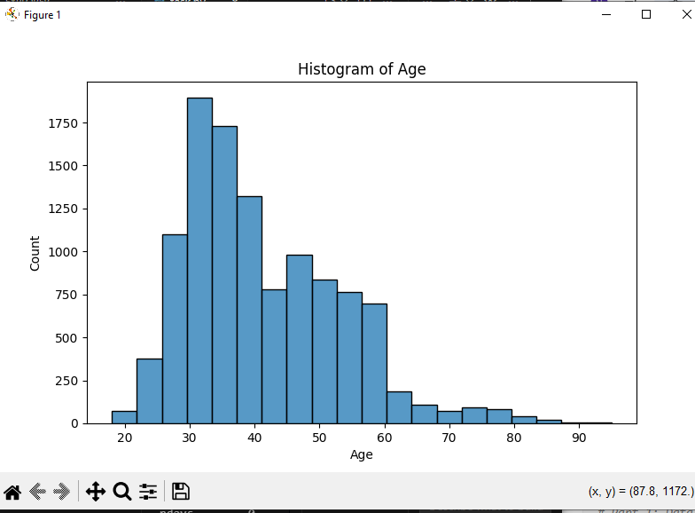
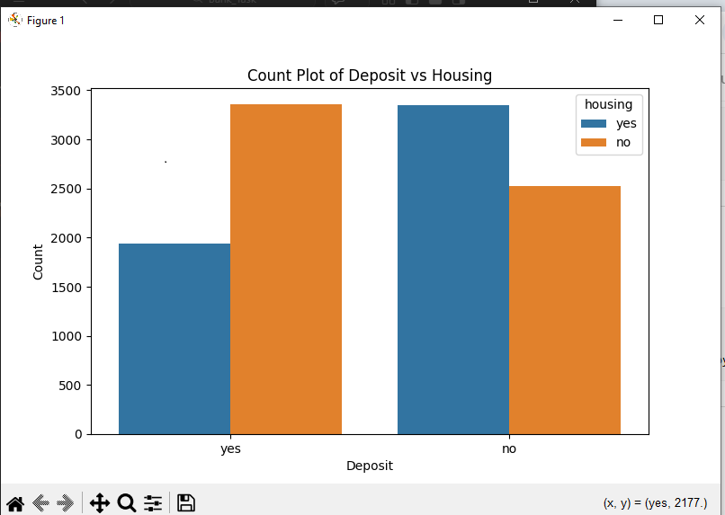

# Bank Marketing Analysis

This project analyzes a bank marketing dataset using Python.

## Tools Used
- Python
- Pandas
- Matplotlib
- Seaborn

## Project Tasks
- Data Cleaning
- Data Exploration
- Data Visualization

## Dataset
Bank Marketing Dataset

## Visualizations
The project includes several visualizations such as:
- Age Distribution Histogram
- Deposit Count Plot

## Author
Naira Kassem
